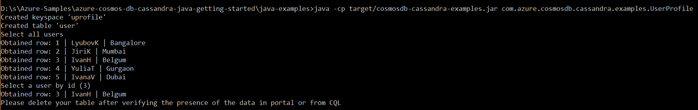

# Developing a Java app with Cassandra API using Azure Cosmos DB
Azure Cosmos DB is a globally distributed multi-model database. One of the supported APIs is the Cassandra API. This sample walks you through creation of keyspace, table, inserting and querying the data.

## Prerequisites
* Before you can run this sample, you must have the following prerequisites:
    * An active Azure Cassandra API account - If you don't have an account, refer to the [Create Cassandra API account](https://aka.ms/cassapijavaqs).
    * [Java Development Kit (JDK) 1.8+](http://www.oracle.com/technetwork/java/javase/downloads/jdk8-downloads-2133151.html)
        * On Ubuntu, run `apt-get install default-jdk` to install the JDK.
    * Be sure to set the JAVA_HOME environment variable to point to the folder where the JDK is installed.
    * [Download](http://maven.apache.org/download.cgi) and [install](http://maven.apache.org/install.html) a [Maven](http://maven.apache.org/) binary archive
        * On Ubuntu, you can run `apt-get install maven` to install Maven.
    * [Git](https://www.git-scm.com/)
        * On Ubuntu, you can run `sudo apt-get install git` to install Git.

## Running this sample
1. Clone this repository using `git clone git@github.com:Azure-Samples/azure-cosmos-db-cassandra-java-getting-started.git cosmosdb`.

2. Change directories to the repo using `cd cosmosdb/java-examples`

3. Next, substitute the Cassandra host, username, password  `java-examples\src\main\resources\config.properties` with your Cosmos DB account's values from connectionstring panel of the portal.

    ```
    cassandra_host=<FILLME>
    cassandra_username=<FILLME>
    cassandra_password=<FILLME>
    ssl_keystore_file_path=<FILLME>
    ssl_keystore_password=<FILLME>
    ```
    If ssl_keystore_file_path is not given in config.properties, then by default <JAVA_HOME>/jre/lib/security/cacerts will be used
    If ssl_keystore_password is not given in config.properties, then the default password 'changeit' will be used

5. Run `mvn clean install` from java-examples folder to build the project. This will generate cosmosdb-cassandra-examples.jar under target folder.
 
6. Run `java -cp target/cosmosdb-cassandra-examples.jar com.azure.cosmosdb.cassandra.examples.UserProfile` in a terminal to start your java application.
   

## About the code
The code included in this sample is intended to get you quickly started with a Java console application that connects to Azure Cosmos DB with the Cassandra API.

## Review the code

If you're interested in learning how the database resources are created in the code, you can review the following snippets. The snippets are all taken from `src/main/java/com/azure/cosmosdb/cassandra/util/CassandraUtils.java` and `src/main/java/com/azure/cosmosdb/cassandra/repository/UserRepository.java` files.

* Cassandra Host, Port, User name and password is set using the connection string page in the Azure portal.

   ```java
   this.cluster = Cluster.builder().addContactPoint(host).withPort(port).withCredentials(username, password).build();
   ```

* The `cluster` connects to the Azure Cosmos DB Cassandra API and returns a session to access.

    ```java
    return cluster.connect();
    ```

* A new keyspace is created.

    ```java
    public void createKeyspace() {
        final String query = "CREATE KEYSPACE IF NOT EXISTS uprofile WITH replication = {'class': 'SimpleStrategy', 'replication_factor': '3' } ";
        session.execute(query);
        LOGGER.info("Created keyspace 'uprofile'");
    }
    ```

* A new table is created.

   ```java
   public void createTable() {
        final String query = "CREATE TABLE IF NOT EXISTS uprofile.user (user_id int PRIMARY KEY, user_name text, user_bcity text)";
        session.execute(query);
        LOGGER.info("Created table 'user'");
   }
   ```

* User entities are inserted using a prepared statement object.

    ```java
    public PreparedStatement prepareInsertStatement() {
        final String insertStatement = "INSERT INTO  uprofile.user (user_id, user_name , user_bcity) VALUES (?,?,?)";
        return session.prepare(insertStatement);
    }

	public void insertUser(PreparedStatement statement, int id, String name, String city) {
        BoundStatement boundStatement = new BoundStatement(statement);
        session.execute(boundStatement.bind(id, name, city));
    }
    ```

* Query to get get all User information.

    ```java
   public void selectAllUsers() {
        final String query = "SELECT * FROM uprofile.user";
        List<Row> rows = session.execute(query).all();

        for (Row row : rows) {
            LOGGER.info("Obtained row: {} | {} | {} ", row.getInt("user_id"), row.getString("user_name"), row.getString("user_bcity"));
        }
    }
    ```

 * Query to get a single User information.

    ```java
    public void selectUser(int id) {
        final String query = "SELECT * FROM uprofile.user where user_id = 3";
        Row row = session.execute(query).one();

        LOGGER.info("Obtained row: {} | {} | {} ", row.getInt("user_id"), row.getString("user_name"), row.getString("user_bcity"));
    }
    ```

## More information

- [Azure Cosmos DB](https://docs.microsoft.com/azure/cosmos-db/introduction)
- [Java driver Source](https://github.com/datastax/java-driver)
- [Java driver Documentation](https://docs.datastax.com/en/developer/java-driver/)
